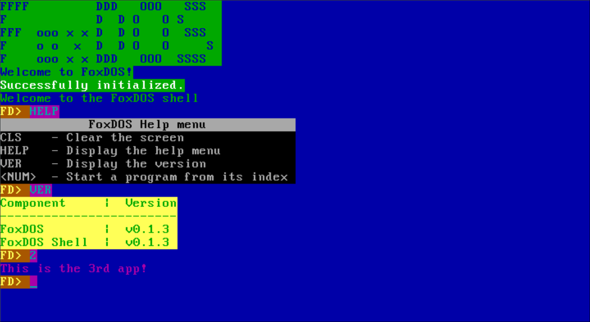

# FoxDOS

A very simple 32-bit OS made to have fun with computers

When you first start FoxDOS, the shell starts. You can view the version using VER.\
You can start a program by entering its index.\
Note that the program index starts at 0, so the 3rd program would be launched by entering 2.

Here's a list of every programs: 
| Index | App Name |
|:--:|-------------|
| 0  | Shell       |
| 1  | VER         |
| 2  | The 3rd app |
| 3  | Err app     |
| 4  | memEdit     |
| 5  | INT         |


# Build
To build FoxDOS, simply run
```sh
make
```
To run it with QEMU, run
```sh
make run
```

# TODO
- Support for multiple disks
- Other drivers: Sound, USB, ...
- Custom executable format
- Maybe a GUI?\
I'm pretty sure there are a lot of other things to do but... eh, forgot them
